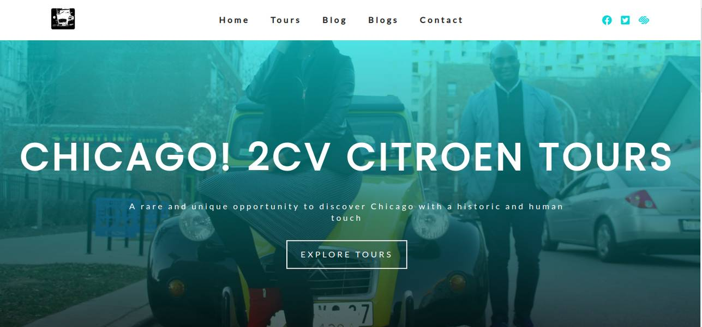
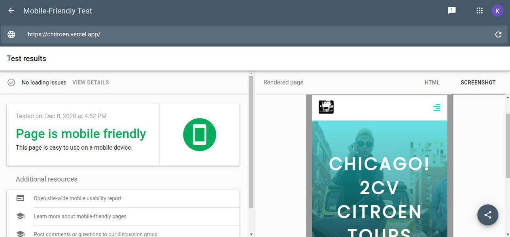

<!-- AUTO-GENERATED-CONTENT:START (STARTER) -->

  

# CH!TROEN: CHICAGO TOURS IN A 1976 2CV CITROEN

This is a tourism promotion site that offers you with the best spots and the best way to see in Chicago:
You will be touring in a open top legendary 1976 French CITROEN 2CV Charleston

## Jamstack web app framwork

- Gatsby
- Styled components
- Contentful headless CMS
- Vercel

## The Site

The website is fully responsive and incredibly engaging and designed for maximum conversion.
It provides beautiful features of the city of Chicago and offers vacationeers irresistible icentive to choose Chicago as their next vacation destination.

## Live Site

<!--   -->

<!--  -->

<!--  -->

<!--  -->

<!-- AUTO-GENERATED-CONTENT:END -->
